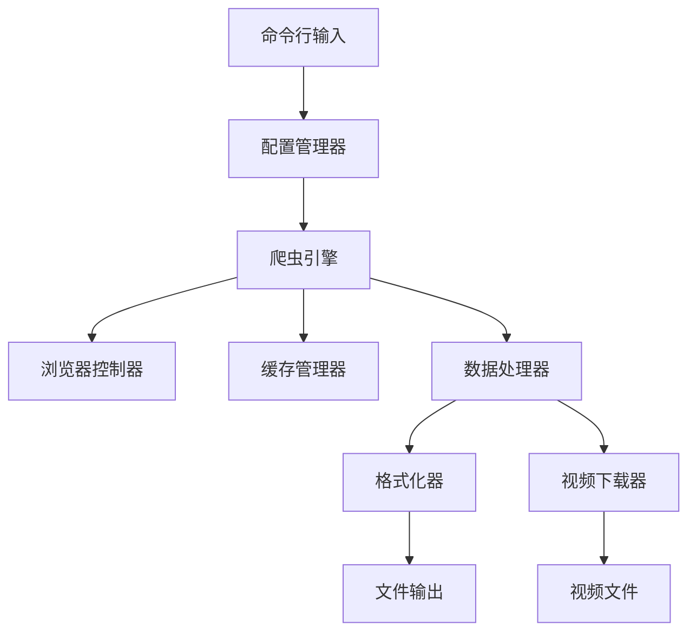

# 开发文档 (Development Guide)

[](https://www.python.org/downloads/)
[](https://www.python.org/dev/peps/pep-0008/)
[]()

抖音热榜爬虫项目的详细开发指南，包含架构设计、代码规范、调试技巧等内容。

[📚 项目文档](./README.md) &nbsp;&nbsp;&nbsp;&nbsp; [🔧 环境配置](#-环境配置) &nbsp;&nbsp;&nbsp;&nbsp; [🚀 快速调试](#-快速调试)

## 📋 目录

- [🏗️ 架构设计](#️-架构设计)
- [🔧 环境配置](#-环境配置)
- [💻 开发指南](#-开发指南)
- [🧪 测试调试](#-测试调试)
- [📊 性能优化](#-性能优化)
- [🔒 安全考虑](#-安全考虑)

## 🏗️ 架构设计

### 📦 模块化架构

项目采用分层架构设计，清晰分离关注点：

```
┌─────────────────────────────────────────┐
│              应用层 (main.py)            │
├─────────────────────────────────────────┤
│              配置层 (config/)            │
├─────────────────────────────────────────┤
│              爬虫层 (spider/)            │
├─────────────────────────────────────────┤
│              核心层 (core/)              │
├─────────────────────────────────────────┤
│              工具层 (utils/)             │
└─────────────────────────────────────────┘
```

### 🔄 数据流架构



### 🎯 核心组件

#### 1. 配置管理系统
- **ConfigManager**: 统一配置管理
- **多层级配置**: 命令行 > environment.py > config.json
- **类型安全**: 使用dataclass进行配置验证

#### 2. 爬虫引擎
- **BaseSpider**: 基础爬虫抽象类
- **DouyinSpider**: 抖音专用爬虫实现
- **浏览器管理**: 支持有头/无头模式

#### 3. 数据处理
- **数据模型**: 类型安全的dataclass模型
- **格式化器**: 支持JSON/CSV/TXT/Markdown格式
- **缓存系统**: 内存+文件双重缓存

#### 4. 视频下载器
- **并发下载**: 多线程下载管理
- **智能检查**: 避免重复下载
- **防盗链**: 智能请求头设置

## 🔧 环境配置

### 开发环境要求

| 组件 | 版本要求 | 说明 |
|------|----------|------|
| **Python** | 3.8+ | 支持dataclass和类型注解 |
| **Chrome** | 90+ | 浏览器自动化 |
| **Memory** | 4GB+ | 推荐配置 |
| **Storage** | 2GB+ | 代码+数据+日志 |

### 📚 核心依赖

```toml
[dependencies]
DrissionPage = "^4.1.1.2"  # 浏览器自动化
requests = "^2.31.0"       # HTTP请求
dataclasses = "*"          # 数据类（Python 3.8+内置）
pathlib = "*"              # 路径处理（Python 3.8+内置）
```

### 🛠️ IDE配置

#### VS Code 推荐配置
```json
{
    "python.defaultInterpreterPath": "./venv/bin/python",
    "python.linting.enabled": true,
    "python.linting.pylintEnabled": true,
    "python.formatting.provider": "black",
    "python.sortImports.args": ["--profile", "black"],
    "files.associations": {
        "*.py": "python"
    }
}
```

#### PyCharm 配置
1. **代码风格**: Settings → Editor → Code Style → Python → 设置为PEP8
2. **类型检查**: Settings → Editor → Inspections → Python → Type checking
3. **文档字符串**: 启用docstring检查

## 💻 开发指南

### 🔨 代码规范

#### 命名约定
```python
# 类名: PascalCase
class VideoDownloader:
    pass

# 函数名: snake_case
def download_video():
    pass

# 常量: UPPER_CASE
MAX_RETRY_COUNT = 3

# 变量: snake_case
download_result = None
```

#### 文档字符串规范
```python
def download_video(self, url: str, filename: Optional[str] = None) -> DownloadResult:
    """
    下载单个视频文件
    
    从指定URL下载视频到本地，支持进度回调和错误处理。
    
    @param {str} url - 视频URL
    @param {Optional[str]} filename - 自定义文件名
    @returns {DownloadResult} 下载结果对象
    @raises {NetworkException} 当网络请求失败时
    
    @example
        result = downloader.download_video(
            url="https://example.com/video.mp4",
            filename="my_video.mp4"
        )
        if result.success:
            print(f"下载成功: {result.file_path}")
    """
    pass
```

#### 类型注解
```python
from typing import Optional, List, Dict, Any
from dataclasses import dataclass

@dataclass
class HotListItem:
    position: int
    title: str
    url: str
    popularity: int
    views: int
    articles: List['VideoArticle'] = field(default_factory=list)
    created_at: Optional[datetime] = None
```

### 🔄 Git工作流

#### 分支策略
```bash
main        # 稳定版本
├── develop # 开发分支
├── feature/video-download  # 功能分支
├── feature/cache-system    # 功能分支
└── hotfix/cache-bug       # 修复分支
```

#### 提交规范
```bash
# 功能: feat: 添加视频下载功能
# 修复: fix: 修复缓存系统bug
# 文档: docs: 更新README文档
# 重构: refactor: 重构配置管理模块
# 测试: test: 添加单元测试
# 样式: style: 修复代码格式
```

### 📝 添加新功能

#### 1. 创建新模块
```bash
# 在相应目录创建新文件
touch src/utils/new_feature.py

# 添加__init__.py导入
echo "from .new_feature import NewFeature" >> src/utils/__init__.py
```

#### 2. 实现功能类
```python
"""
新功能模块

@author: Your Name
@version: 1.0.0
@date: 2025-08-17
"""

from typing import Optional
from ..core.exceptions import ValidationException

class NewFeature:
    """
    新功能实现类
    
    提供XXX功能，支持YYY特性。
    """
    
    def __init__(self, config: 'AppConfig', logger: Optional[logging.Logger] = None):
        self.config = config
        self.logger = logger or logging.getLogger(__name__)
    
    def process(self, data: Any) -> Any:
        """处理数据的主要方法"""
        try:
            # 实现逻辑
            return result
        except Exception as e:
            self.logger.error(f"处理失败: {str(e)}")
            raise
```

#### 3. 更新配置
```python
# config.json 添加配置项
{
    "new_feature": {
        "enabled": false,
        "option1": "value1"
    }
}

# config_manager.py 添加字段
@dataclass
class AppConfig:
    # 新功能配置
    new_feature_enabled: bool = False
    new_feature_option1: str = "default_value"
```

## 🧪 测试调试

### 🚀 快速调试

#### 基础测试命令
```bash
# 干运行模式 - 验证配置和逻辑
python main.py --headless -n 1 --dry-run

# 调试模式 - 详细日志输出
python main.py --headless -n 1 --debug

# 性能模式 - 显示性能统计
python main.py --headless -n 1 --performance
```

#### 功能专项测试
```bash
# 测试数据爬取
python main.py --headless -n 3 --format json

# 测试视频下载
python main.py --headless -n 1 --download-videos

# 测试格式输出
python main.py --headless -n 1 --format csv -o test.csv
python main.py --headless -n 1 --format markdown -o test.md
```

### 🔍 调试技巧

#### 1. 日志调试
```python
# 启用详细日志
import logging
logging.basicConfig(level=logging.DEBUG)

# 在代码中添加调试点
self.logger.debug(f"处理数据: {data}")
self.logger.info(f"当前状态: {status}")
```

#### 2. 缓存调试
```bash
# 清除缓存重新运行
Remove-Item "cache\cache.json" -Force
python main.py --headless -n 1

# 检查缓存内容
cat cache/cache.json | python -m json.tool
```

#### 3. 浏览器调试
```python
# 启用有头模式查看浏览器行为
python main.py -n 1  # 不使用 --headless

# 添加断点调试
import pdb; pdb.set_trace()
```

### 📊 性能分析

#### 内存分析
```python
import tracemalloc

tracemalloc.start()
# 运行代码
current, peak = tracemalloc.get_traced_memory()
print(f"当前内存: {current / 1024 / 1024:.1f} MB")
print(f"峰值内存: {peak / 1024 / 1024:.1f} MB")
```

#### 时间分析
```python
import time
from functools import wraps

def timing_decorator(func):
    @wraps(func)
    def wrapper(*args, **kwargs):
        start = time.time()
        result = func(*args, **kwargs)
        end = time.time()
        print(f"{func.__name__} 耗时: {end - start:.2f}秒")
        return result
    return wrapper
```

## 📊 性能优化

### ⚡ 爬取性能

#### 1. 请求优化
```python
# 合理设置请求间隔
REQUEST_INTERVAL = 1.0  # 避免被限流

# 使用连接池
session = requests.Session()
adapter = HTTPAdapter(pool_connections=10, pool_maxsize=20)
session.mount('http://', adapter)
```

#### 2. 缓存策略
```python
# 设置合适的缓存时间
CACHE_DURATION = 300  # 5分钟

# 定期清理过期缓存
cache_manager.cleanup_expired()
```

#### 3. 并发控制
```python
# 限制并发数量
MAX_CONCURRENT = 3

# 使用线程池
with ThreadPoolExecutor(max_workers=MAX_CONCURRENT) as executor:
    futures = [executor.submit(download_video, url) for url in urls]
```

### 🧠 内存优化

#### 1. 大对象管理
```python
# 及时释放大对象
del large_data
gc.collect()

# 使用生成器处理大数据
def process_items():
    for item in large_dataset:
        yield process_item(item)
```

#### 2. 缓存大小控制
```python
# 限制缓存大小
MAX_CACHE_SIZE = 100

# 使用LRU策略
from functools import lru_cache

@lru_cache(maxsize=128)
def expensive_function(param):
    return result
```

## 🔒 安全考虑

### 🛡️ 数据安全

#### 1. 敏感信息处理
```python
# 不要在代码中硬编码敏感信息
# ❌ 错误做法
COOKIE = "session_id=abc123..."

# ✅ 正确做法
COOKIE = os.environ.get('DOUYIN_COOKIE', '')
```

#### 2. 输入验证
```python
def validate_url(url: str) -> bool:
    """验证URL安全性"""
    if not url.startswith(('http://', 'https://')):
        return False
    
    # 检查域名白名单
    allowed_domains = {'douyin.com', 'snssdk.com'}
    parsed = urlparse(url)
    return any(parsed.netloc.endswith(domain) for domain in allowed_domains)
```

#### 3. 文件安全
```python
def sanitize_filename(filename: str) -> str:
    """清理文件名，防止路径遍历攻击"""
    # 移除危险字符
    filename = re.sub(r'[<>:"/\\|?*]', '_', filename)
    # 防止路径遍历
    filename = os.path.basename(filename)
    return filename[:255]  # 限制长度
```

### 🔐 网络安全

#### 1. 请求头安全
```python
# 设置合适的User-Agent
headers = {
    'User-Agent': 'Mozilla/5.0 (Windows NT 10.0; Win64; x64) ...',
    'Accept': 'text/html,application/xhtml+xml,application/xml;q=0.9,*/*;q=0.8',
    'Accept-Language': 'zh-CN,zh;q=0.9,en;q=0.8',
    'Connection': 'keep-alive',
}
```

#### 2. 代理安全
```python
# 使用代理时的安全配置
proxies = {
    'http': 'http://proxy:port',
    'https': 'https://proxy:port'
}

# 验证代理
response = requests.get('https://httpbin.org/ip', proxies=proxies, timeout=10)
```

### ⚠️ 错误处理

#### 1. 异常分类
```python
# 自定义异常层次
class SpiderException(Exception):
    """爬虫基础异常"""
    pass

class NetworkException(SpiderException):
    """网络相关异常"""
    pass

class ValidationException(SpiderException):
    """数据验证异常"""
    pass
```

#### 2. 安全日志
```python
# 不要在日志中记录敏感信息
# ❌ 错误做法
logger.info(f"使用Cookie: {cookie}")

# ✅ 正确做法
logger.info(f"使用Cookie: {cookie[:10]}...")
```

## 📚 最佳实践

### 🎯 开发流程

1. **需求分析** → 明确功能需求和技术需求
2. **设计架构** → 设计模块结构和接口
3. **编写代码** → 遵循代码规范，添加文档
4. **单元测试** → 编写测试用例，确保质量
5. **集成测试** → 测试模块间的协作
6. **性能测试** → 分析性能瓶颈，优化代码
7. **安全审计** → 检查安全漏洞，修复问题
8. **文档更新** → 更新相关文档

### 🔄 持续改进

- **代码审查**: 定期进行代码审查
- **性能监控**: 监控关键性能指标
- **用户反馈**: 收集和处理用户反馈
- **技术更新**: 定期更新依赖库

---

## 📞 开发支持

- **技术讨论**: [Issues](https://github.com/MingTechPro/Pyhton_douyin_hot/issues)
- **开发者邮箱**: chenpeiming52001@163.com
- **代码贡献**: 欢迎提交 Pull Request

⭐ **感谢每一位贡献者的努力！**